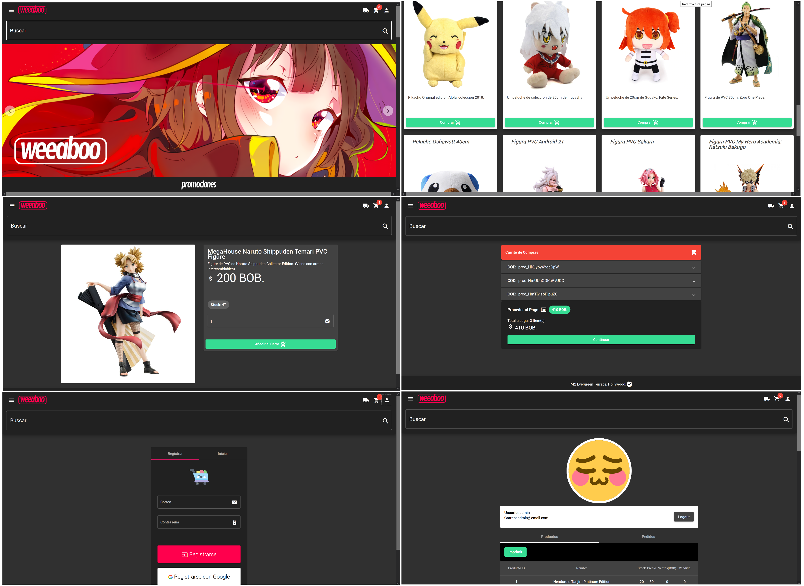

	

 Otaku e-commerce store made in Angular + NodeJS + Postgres inspired by: [J-List](https://jlist.com/) and [Tokyo Otaku Mode](https://otakumode.com/)

	

### Packages
 **Front:** 
> [Angular Material](https://material.angular.io/), [jsPDF](https://www.npmjs.com/package/jspdf), [Ivy Carousel](http://ivylab.space/carousel), [Flex-Layout](https://www.npmjs.com/package/@angular/flex-layout)

 **Back:** 
 > [Sequelize (ORM)](https://sequelize.org/)

 Done as a project for the first exam of the subject _Information systems_.
